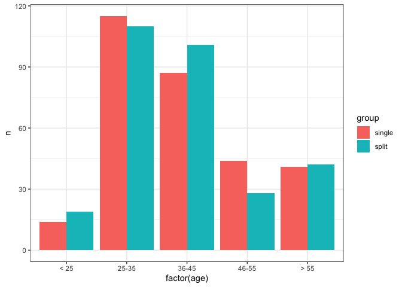
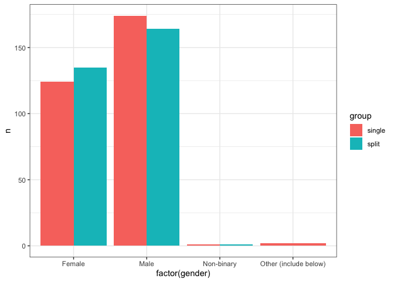
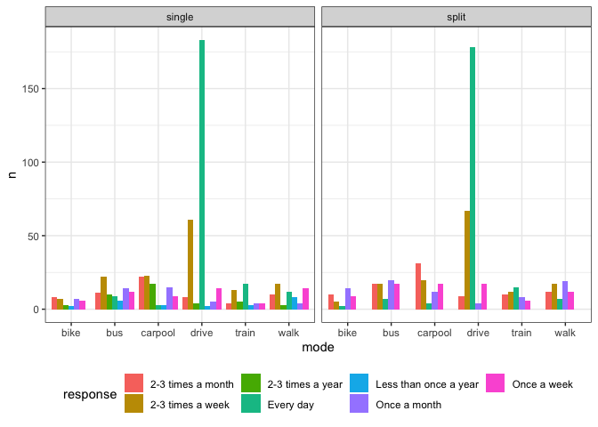
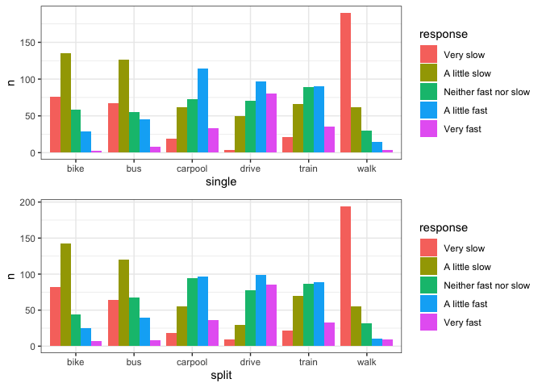
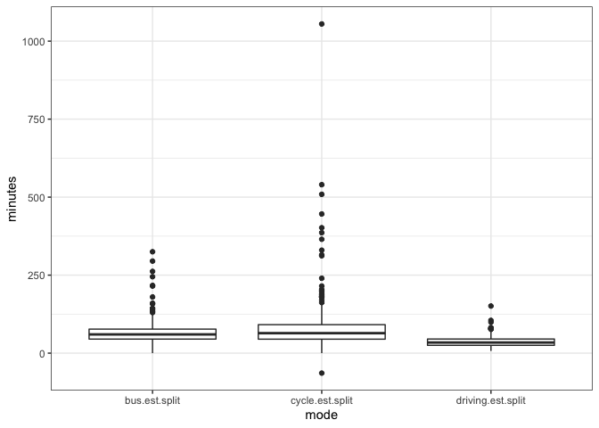
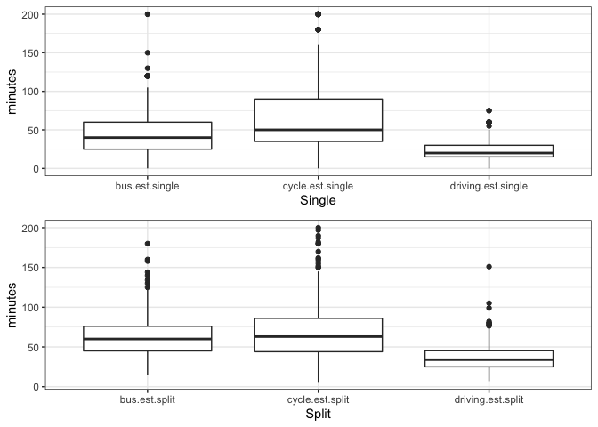
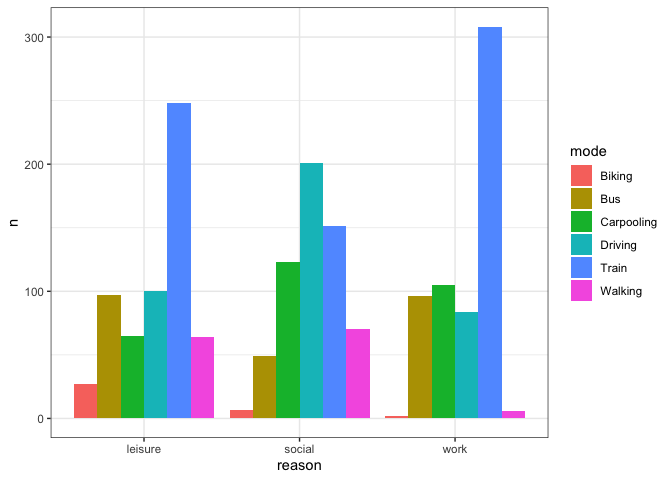
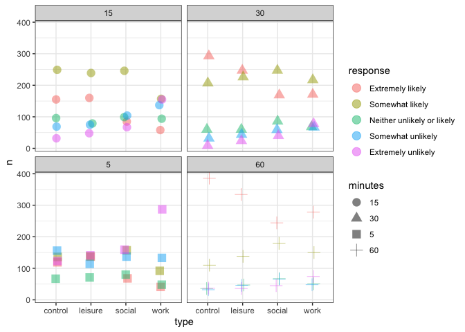
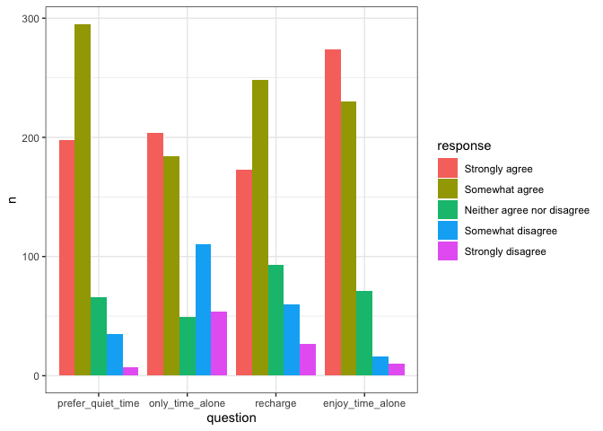

Commute Survey Analysis
================

-   [Survey respondent demographics](#demographics)
-   [Commute mode analysis](#mode)
-   [Commute feel analysis](#feel)
-   [Commute time analysis](#time)
-   [Time estimate difference](#estimate)
-   [Use of commute time](#use)

``` r
library(tidyverse)
library(rlang)
library(scales)

theme_set(theme_bw())

commute <- read_csv("Time+Lab+Study+(v.+2.0)_February+11,+2021_09.10.zip")

# subset data and rename columns
commute <- commute %>% 
  select(!(StartDate:UserLanguage)) %>%
  rename_all(list(~make.names(.)))

# names(commute) # display column names
```

``` r
# custom function to count the total number by group
total <- function(.data, group_col) {
 
   result <- .data %>% 
    group_by({{ group_col }}) %>%
    summarise(n=n())
  
   return(result)
}
```

``` r
# number of respondents having commuted in the past 5 years
commute %>% filter(commute.check == "Yes" | commute.check == "No") %>% total(commute.check)
```

    ## # A tibble: 2 x 2
    ##   commute.check     n
    ## * <chr>         <int>
    ## 1 No               26
    ## 2 Yes             601

``` r
# filter commuters
commute <- commute %>% filter(commute.check == "Yes")
```

### Respondent demographics<a name="demographics"></a>

``` r
# check demographics between single- and broken-out time 

# add a new group column to indicate whether the respondent answered single- or split-time question
# convert age, gender, and group to categorical variables

age_levels <- c("< 25" ,"25-35", "36-45", "46-55", "> 55")
commute <- commute %>% 
  mutate(group = if_else(is.na(commute.feel.single_1), "split", "single")) %>%
  mutate(age = factor(age, levels=age_levels), gender = factor(gender), group = factor(group))

# overall age and gender distribution
commute %>% total(gender)
```

    ## # A tibble: 4 x 2
    ##   gender                    n
    ## * <fct>                 <int>
    ## 1 Female                  259
    ## 2 Male                    338
    ## 3 Non-binary                2
    ## 4 Other (include below)     2

``` r
commute %>% total(age)
```

    ## # A tibble: 5 x 2
    ##   age       n
    ## * <fct> <int>
    ## 1 < 25     33
    ## 2 25-35   225
    ## 3 36-45   188
    ## 4 46-55    72
    ## 5 > 55     83

``` r
# # number of respondents in each group
commute %>% total(group)
```

    ## # A tibble: 2 x 2
    ##   group      n
    ## * <fct>  <int>
    ## 1 single   301
    ## 2 split    300

``` r
# visualize distribution of age and gender for each group
commute %>% 
  group_by(group, age) %>% 
  summarise(n=n()) %>%
  ggplot(aes(factor(age), n, fill=group)) + geom_col(position = "dodge") 
```

<!-- -->

``` r
commute %>% 
  group_by(group, gender) %>% 
  summarise(n=n()) %>% 
  ggplot(aes(factor(gender), n, fill=group)) + geom_col(position = "dodge")
```

<!-- -->

``` r
# conduct chi-squared test for age and gender
with(commute, chisq.test(age, group))
```

    ## 
    ##  Pearson's Chi-squared test
    ## 
    ## data:  age and group
    ## X-squared = 5.4772, df = 4, p-value = 0.2417

``` r
with(commute, chisq.test(gender, group))
```

    ## Warning in chisq.test(gender, group): Chi-squared approximation may be incorrect

    ## 
    ##  Pearson's Chi-squared test
    ## 
    ## data:  gender and group
    ## X-squared = 2.7614, df = 3, p-value = 0.4299

The distribution of age and gender is similar. Respondents are mostly
males and females, more males than female. They are aged between 25-45.

### Commute mode analysis<a name="mode"></a>

``` r
# how often each commute mode was used in the past 5 years
commute_freq <- commute %>%
  select(
    commute.freq.single_1:commute.freq.single_6,
    commute.freq.split_1:commute.freq.split_6
    ) %>%
  pivot_longer(
    everything(),
    names_to = c("group", "mode"),
    names_prefix = "commute.freq.",
    names_pattern = "(\\w+)_(.)",
    values_to = 'response',
    values_drop_na = TRUE
    ) %>%
  mutate(
    mode = recode(mode, 
                  "1" = "drive", 
                  "2" = "carpool", 
                  "3" = "bus", 
                  "4" = "train",
                  "5" = "bike",
                  "6" = "walk"
                  )
    ) %>%
  group_by(group, mode, response) %>%
  summarize(n=n())

# create frequency table
commute_freq %>% 
  pivot_wider(
    names_from = mode, 
    values_from = n, 
    values_fill = list(total = 0)
    )
```

    ## # A tibble: 12 x 8
    ## # Groups:   group [2]
    ##    group  response               bike   bus carpool drive train  walk
    ##    <chr>  <chr>                 <int> <int>   <int> <int> <int> <int>
    ##  1 single 2-3 times a month         8    11      22     8     4    10
    ##  2 single 2-3 times a week          7    22      23    61    13    17
    ##  3 single 2-3 times a year          3    10      17     4     5     3
    ##  4 single Less than once a year     2     6       3     2     3     8
    ##  5 single Once a month              7    14      15     5     4     4
    ##  6 single Once a week               6    12       9    14     4    14
    ##  7 single Every day                NA     9       3   183    17    12
    ##  8 split  2-3 times a month        10    17      31     9    10    12
    ##  9 split  2-3 times a week          5    17      20    67    12    17
    ## 10 split  Every day                 2     7       4   178    15     7
    ## 11 split  Once a month             14    20      12     4     8    19
    ## 12 split  Once a week               9    17      17    17     6    12

``` r
# plot bar chart
commute_freq %>%
  ggplot(aes(mode, n, fill = response)) + 
  geom_col(position=position_dodge(preserve = "single")) +
  facet_wrap(~ group) + 
  theme(legend.position = 'bottom') 
```

<!-- -->

### Commute feel analysis<a name="feel"></a>

``` r
# single- & broken-out-time group commute feel analysis

# convert speed to categorical variable
speed_levels <- c("Very slow" ,"A little slow", "Neither fast nor slow", "A little fast", "Very fast")

commute_feel <- commute %>%
  select(commute.feel.single_1:commute.feel.single_6,
         commute.feel.split_1:commute.feel.split_6) %>%
  pivot_longer(everything(), 
               names_to = c("group", "mode"),
               names_prefix = "commute.feel.",
               names_pattern = "(\\w+)_(.)",
               values_to = "response", 
               values_drop_na = TRUE) %>% 
  mutate(
    mode = recode(mode, 
                  "1" = "drive", 
                  "2" = "carpool", 
                  "3" = "bus", 
                  "4" = "train",
                  "5" = "bike",
                  "6" = "walk"
                  ),
    response = replace(response, 
                       response=="Neither fast or slow", "Neither fast nor slow"
                       ),
    response = factor(response, levels = speed_levels)
    ) %>%
    group_by(group, mode, response) %>% 
    summarize(n=n()) 


# single-time group
# create frequency table
commute_feel %>%
  filter(group == "single") %>%
  pivot_wider(names_from = mode, values_from = n, values_fill = list(n=0))
```

    ## # A tibble: 5 x 8
    ## # Groups:   group [1]
    ##   group  response               bike   bus carpool drive train  walk
    ##   <chr>  <fct>                 <int> <int>   <int> <int> <int> <int>
    ## 1 single Very slow                76    67      19     4    21   190
    ## 2 single A little slow           135   126      62    50    66    62
    ## 3 single Neither fast nor slow    58    55      73    70    89    30
    ## 4 single A little fast            29    45     114    97    90    15
    ## 5 single Very fast                 3     8      33    80    35     4

``` r
# plot bar graph
commute_feel_single <- commute_feel %>%
  filter(group == "single") %>%
  ggplot(aes(mode, n, fill=response)) + 
  geom_col(position=position_dodge(preserve = "single")) +
  xlab(label = "single")

# broken-out-time group
# create frequency table
commute_feel %>%
  filter(group == "split") %>%
  pivot_wider(names_from = mode, values_from = n, values_fill = list(n=0)) 
```

    ## # A tibble: 5 x 8
    ## # Groups:   group [1]
    ##   group response               bike   bus carpool drive train  walk
    ##   <chr> <fct>                 <int> <int>   <int> <int> <int> <int>
    ## 1 split Very slow                82    64      18     9    22   194
    ## 2 split A little slow           142   120      55    29    70    55
    ## 3 split Neither fast nor slow    44    68      94    78    86    32
    ## 4 split A little fast            25    40      97    99    89    10
    ## 5 split Very fast                 7     8      36    85    33     9

``` r
# plot bar graph
commute_feel_split <- commute_feel %>%
  filter(group == "split") %>%
  ggplot(aes(mode, n, fill=response)) + 
  geom_col(position=position_dodge(preserve = "single")) +
  xlab(label = "split")


gridExtra::grid.arrange(commute_feel_single, commute_feel_split)
```

<!-- -->

More people in the single group feel carpool is fast than ones in the
broken-out-time group.

### Commute time analysis<a name="time"></a>

``` r
# single time: display a box plot for the time estimate of each mode
single_estimate <- commute %>%
  filter(group == "single") %>%
  select(driving.est.single:cycle.est.single, group) %>%
  mutate(across(where(is.character), as.numeric)) %>%
  pivot_longer(!group, names_to = "mode", values_to = "minutes", values_drop_na = TRUE)

box_plot_single <- single_estimate %>% 
  ggplot(aes(mode, minutes)) + geom_boxplot() + xlab(label="Single")


# broken-out time: add up minutes for each mode to calculate total commute time and display box plot
split_estimate <- commute %>% 
  filter(group == "split") %>%
  select(driving.est.split_1_9:cycle.est.split_5_1, group) %>%
  mutate(across(where(is.character), as.numeric)) %>%
  rowwise() %>%
  transmute(
    driving.est.split = sum(c_across(driving.est.split_1_9:driving.est.split_6_9)),
    bus.est.split = sum(c_across(bus.est.split_1_1:bus.est.split_5_1)),
    cycle.est.split = sum(c_across(cycle.est.split_1_1:cycle.est.split_5_1)),
    group
    ) %>%
  pivot_longer(!group, names_to = "mode", values_to = "minutes", values_drop_na = TRUE)

# box plot including outliers
split_estimate %>% 
  ggplot(aes(mode, minutes)) + geom_boxplot()
```

<!-- -->

``` r
box_plot_split <- split_estimate %>% 
  filter(minutes <= 200 & minutes > 0) %>%
  ggplot(aes(mode, minutes)) + geom_boxplot() + xlab(label="Split")

gridExtra::grid.arrange(box_plot_single, box_plot_split)
```

<!-- -->

``` r
# split_estimate %>% 
#   filter(minutes > 200)
# 
# single_estimate  %>% 
#   filter(minutes == 200)

split_estimate %>%
  filter(mode == "driving.est.split") %>% select("minutes") %>% summary()
```

    ##     minutes      
    ##  Min.   :  7.00  
    ##  1st Qu.: 25.00  
    ##  Median : 34.00  
    ##  Mean   : 37.20  
    ##  3rd Qu.: 45.25  
    ##  Max.   :151.00

``` r
single_estimate %>%
  filter(mode == "driving.est.single") %>% select("minutes") %>% summary()
```

    ##     minutes     
    ##  Min.   : 0.00  
    ##  1st Qu.:15.00  
    ##  Median :20.00  
    ##  Mean   :23.78  
    ##  3rd Qu.:30.00  
    ##  Max.   :75.00

The broken-out group contained outliers for the cycle estimate.
Estimates bigger than 200 and smaller than 0 excluded. The t-test showed
a difference in bus and driving estimates.

### Time estimate difference bewteen two groups<a name="estimate"></a>

``` r
# combine time-estimate tables and conduct t-test between single- and broken-time groups for each commute mode 

split_estimate %>% 
  filter(minutes <= 200 & minutes > 0) %>%
  bind_rows(single_estimate) %>%
  mutate(
    mode = recode(mode,
      "driving.est.single" = "driving.est",
      "driving.est.split" = "driving.est",
      "bus.est.single" = "bus.est",
      "bus.est.split" = "bus.est",
      "cycle.est.single" = "cycle.est",
      "cycle.est.split" = "cycle.est",
    )
  ) %>%
  group_by(mode) %>%
  do(broom::tidy(t.test(minutes ~ group, data = .))) %>%
  transmute(p.value=round(p.value,4), statistic=round(statistic,4)) 
```

    ## # A tibble: 3 x 3
    ## # Groups:   mode [3]
    ##   mode        p.value statistic
    ##   <chr>         <dbl>     <dbl>
    ## 1 bus.est       0        -7.95 
    ## 2 cycle.est     0.742     0.330
    ## 3 driving.est   0       -10.4

### Use of commute time<a name="use"></a>

#### Productivity

``` r
# 3 productivity questions

productivity <- commute %>%
  select(method.pref.leisure, method.pref.social, method.pref.work) %>% 
  pivot_longer(everything(), 
               names_to = 'reason', 
               names_prefix = 'method.pref.', 
               values_to = 'mode') %>% 
  mutate(mode = recode(
    mode, 
    'Driving (alone, not carpooling)' = 'Driving', 
    'Driving (carpooling with others)' = 'Carpooling'
    )
  ) %>%
  group_by(reason, mode) %>% 
  summarise(n = n())

# create frequency table
productivity %>%
  pivot_wider(names_from = reason, values_from = n, values_fill = list(n=0)) 
```

    ## # A tibble: 6 x 4
    ##   mode       leisure social  work
    ##   <chr>        <int>  <int> <int>
    ## 1 Biking          27      7     2
    ## 2 Bus             97     49    96
    ## 3 Carpooling      65    123   105
    ## 4 Driving        100    201    84
    ## 5 Train          248    151   308
    ## 6 Walking         64     70     6

``` r
# plot bar chart
productivity  %>%
  ggplot(aes(reason, n, fill=mode)) + geom_col(position=position_dodge(preserve = "single"))
```

<!-- -->

People feel most productive for work and leisure when using train. They
feel most productive socially when they drive alone?

#### Commute time use and length

``` r
# 4 motivator questions (control, work, social, leisure)

likely_levels <- c("Extremely likely" ,"Somewhat likely", "Neither unlikely or likely", "Somewhat unlikely", "Extremely unlikely")

motivator <- commute %>%
  select(control.motivator_1:control.motivator_4, 
         work.motivator_1:work.motivator_4,
         social.motivator_1:social.motivator_4,
         leisure.motivator_1:leisure.motivator_4) %>%
  pivot_longer(everything(),
               names_to = c("type", "minutes"),
               names_pattern = "(\\w+).(\\w+_.)",
               values_to = "response",
               values_drop_na = TRUE) %>%
  mutate(minutes = recode(
    minutes,
    "motivator_1" = "5",
    "motivator_2" = "15",
    "motivator_3" = "30",
    "motivator_4" = "60",
    ),
    across(where(is.character), as.factor),
    response = factor(response, levels = likely_levels)
    ) %>%
  group_by(type, minutes, response) %>%
  summarise(n=n())
```

    ## `summarise()` has grouped output by 'type', 'minutes'. You can override using the `.groups` argument.

``` r
# create frequency table
motivator %>%
  pivot_wider(names_from = type, values_from = n, values_fill = list(n=0))
```

    ## # A tibble: 20 x 6
    ## # Groups:   minutes [4]
    ##    minutes response                   control leisure social  work
    ##    <fct>   <fct>                        <int>   <int>  <int> <int>
    ##  1 15      Extremely likely               155     160     85    58
    ##  2 15      Somewhat likely                249     239    246   157
    ##  3 15      Neither unlikely or likely      96      79     99    94
    ##  4 15      Somewhat unlikely               69      75    104   137
    ##  5 15      Extremely unlikely              32      48     67   155
    ##  6 30      Extremely likely               293     247    169   171
    ##  7 30      Somewhat likely                207     226    247   217
    ##  8 30      Neither unlikely or likely      60      60     86    68
    ##  9 30      Somewhat unlikely               32      44     59    67
    ## 10 30      Extremely unlikely               9      24     40    78
    ## 11 5       Extremely likely               119     137     68    41
    ## 12 5       Somewhat likely                136     138    157    92
    ## 13 5       Neither unlikely or likely      67      71     80    48
    ## 14 5       Somewhat unlikely              156     114    137   133
    ## 15 5       Extremely unlikely             123     141    159   287
    ## 16 60      Extremely likely               386     334    244   278
    ## 17 60      Somewhat likely                110     138    179   150
    ## 18 60      Neither unlikely or likely      36      47     67    51
    ## 19 60      Somewhat unlikely               32      46     66    48
    ## 20 60      Extremely unlikely              37      36     45    74

``` r
# plot scatter plot

motivator %>%
  ggplot(aes(type, n, color=response)) +
  geom_point(aes(shape=minutes), size=4, position=position_jitter(h=0.05, w=0.05), alpha = 0.5) +
  facet_wrap(~ minutes, ncol = 2) 
```

<!-- -->

People feel they can make use of their commute to work when it’s more
than 30 minutes. For other types, they can be most productive when it
falls between 15-30 min.

### Commute and alone-time

``` r
# 1st me-time question

agreement_levels <- c("Strongly agree" ,"Somewhat agree", "Neither agree nor disagree", "Somewhat disagree", "Strongly disagree")

me_time <- commute %>%
  select(me.time_1:me.time_4) %>%
  pivot_longer(everything(),
               names_to = "question",
               names_prefix = "me.time.",
               values_to = "response",
               values_drop_na = TRUE) %>%
  mutate(question = recode(
    factor(question),
    "1" = 'prefer_quiet_time',
    "2" = 'only_time_alone',
    "3" = 'recharge',
    "4" = 'enjoy_time_alone',
    ),
    response = factor(response, levels=agreement_levels)
  ) %>%
  group_by(question, response) %>%
  summarise(n=n())


# create frequency table
me_time %>%
  pivot_wider(names_from = question, values_from = n, values_fill = list(n=0))
```

    ## # A tibble: 5 x 5
    ##   response            prefer_quiet_ti… only_time_alone recharge enjoy_time_alone
    ##   <fct>                          <int>           <int>    <int>            <int>
    ## 1 Strongly agree                   198             204      173              274
    ## 2 Somewhat agree                   295             184      248              230
    ## 3 Neither agree nor …               66              49       93               71
    ## 4 Somewhat disagree                 35             110       60               16
    ## 5 Strongly disagree                  7              54       27               10

``` r
# plot bar graph
me_time %>% 
   ggplot(aes(question, n, fill=response)) + geom_col(position=position_dodge(preserve = "single"))
```

<!-- -->

People prefer their commute to be their time alone, and many people
noted it’s their only time alone. They feel recharged and enjoy their
time alone.

``` r
# count the number of yes and no for the question asking whether to make up alone time lost
commute %>% total(lost.me.time)
```

    ## # A tibble: 2 x 2
    ##   lost.me.time     n
    ## * <chr>        <int>
    ## 1 No             310
    ## 2 Yes            291

``` r
# Q. How would you attempt to make up for the private time you would lose as a result of changing from commuting alone to carpooling or telecommuting?
commute %>% 
  filter(lost.me.time == "Yes") %>%
  transmute(response = make.up.me.time) %>% 
  distinct()
```

    ## # A tibble: 290 x 1
    ##    response                                                                     
    ##    <chr>                                                                        
    ##  1 i would go take a drive alone to recharge                                    
    ##  2 finding another way to have alone time each day                              
    ##  3 I would need to find additional alone time.                                  
    ##  4 I would probably stay late or reduce time spent onmy leisure activities      
    ##  5 REarrange my schedule a little bit to fit in other activities                
    ##  6 I would use it to get chores done.                                           
    ##  7 I would try to stay up longer at night                                       
    ##  8 try and take some time for myself and maybe just go on a drive once or twice…
    ##  9 I would use my breaks at work to focus more on personal time.                
    ## 10 do something productive                                                      
    ## # … with 280 more rows

Half of the respondents said if they lose their time alone during
commute, they would try to make it up.
